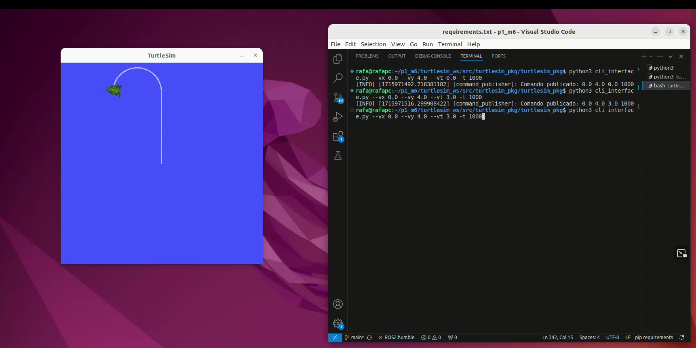

# Tartaruguinha da Sorte

Nome: Rafaela Cristina Rojas Lemos

Prova 1 - Módulo 6



Para assistir o vídeo completo de demonstração, clique [aqui](https://drive.google.com/file/d/1eS_i4uramZqmifkkEhEOkLOLSgsCSlgC/view?usp=sharing)

---

## Instalação

Certifique-se de ter o ROS2 instalado em seu sistema. Além disso, certifique-se de ter todas as dependências instaladas, elas estão disponíveis no arquivo `requirements.txt` na raíz do projeto, para isso utilize o comando:

```bash
pip install -r requirements.txt
```


1. Clone este repositório em seu ambiente:


```bash
git clone https://github.com/rafaelarojas/p1_m6
```


2. Navegue até o diretório do código:


```bash
cd turtlesim_ws/src/turtlesim_pkg/turtlesim_pkg
```


## Executar

Para executar, confira se está dentro da pasta `turtlesim_ws/src/turtlesim_pkg/turtlesim_pkg`.

1. No primeiro terminal digite:


```bash
ros2 run turtlesim turtlesim_node
```


2. Abra um segundo terminal e execute o arquivo `turtlesim_controller.py`:


```bash
python3 turtlesim_controller.py
```


3. Abra um terceiro terminal e digite os comandos para fazer a tartaruga andar, no formato `vx vy vtheta tempo_em_ms`:

Exemplo
```bash
python3 cli_interface.py --vx 0.0 --vy 4.0 --vt 3.0 -t 1000
```
---

Todas as referências e apoios utilizados estão em `turtlesim_ws/src/turtlesim_pkg/turtlesim_pkg/referencias.md`
